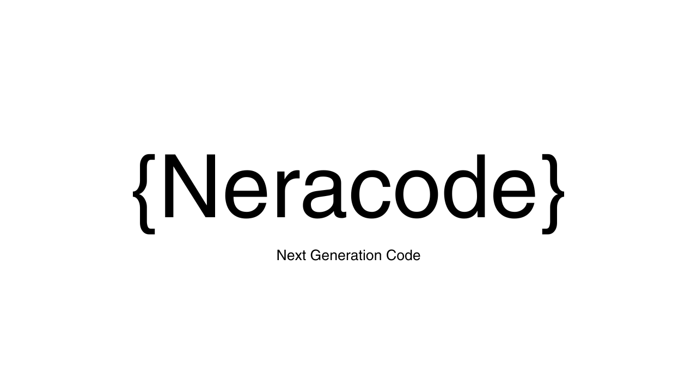

# **Neracode**
### Next Generation Code 

## Sekilas

Neracode (Next Generation Code) merupakan komunitas yang didirikan di jurusan Rekayasa Perangkat Lunak SMKN 1 Kota Bekasi yang bertujuan menjadi wadah atau forum diskusi bagi siswa/siswi. Neracode adalah tempat para siswa berkumpul dalam mendalami dunia pemrograman. Ini adalah klub yang menyediakan platform bagi siswa untuk belajar, berlatih, dan berkolaborasi dalam berbagai proyek dan aktivitas coding.

## Tujuan

* Menjalin tali silaturahmi antar siswa/siswi RPL SMKN 1
* Memberikan wadah kepada murid untuk saling bertukar pengetahuan
* Meningkatkan potensi siswa dalam bidang IPTEK
* Mendorong anggota untuk berkontribusi pada proyek perangkat lunak sumber terbuka

## Susunan Kepengurusan

* Taufik : Ketua Program dan Tutor
* Dicky  : Wakil Ketua Program dan Tutor
* Herry  : Tutor
* Muammar Syauqi Arrasya : Tutor
* Abdi Malika : Tutor
* Ibnu Prayudha : Tutor
* Fahmi : Tutor
* Deo : Tutor
* Fariz : Tutor
* Hafidh : Tutor
* Fadlan : Tutor
* Aprilia : Sekretaris
* Anna : Sekretaris
* Syafira : Sekretaris

## Requirements Project

* NodeJS v20 Required
* Vite latest version

